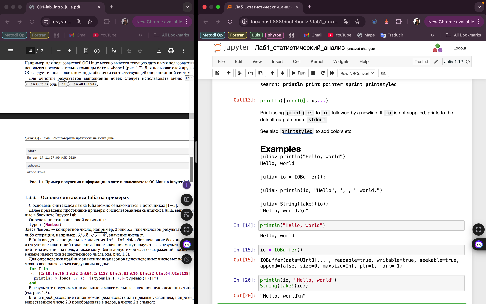
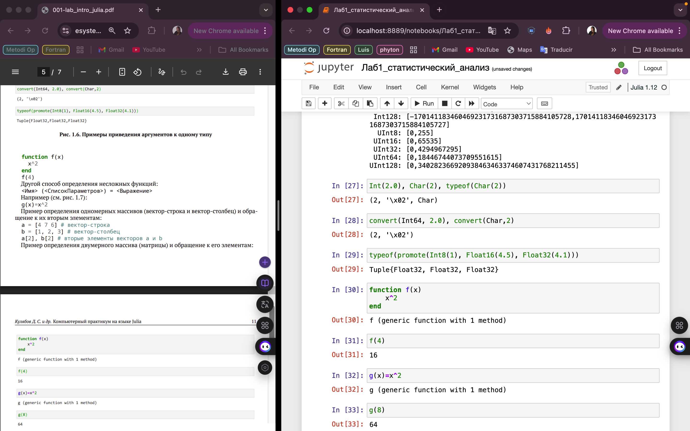
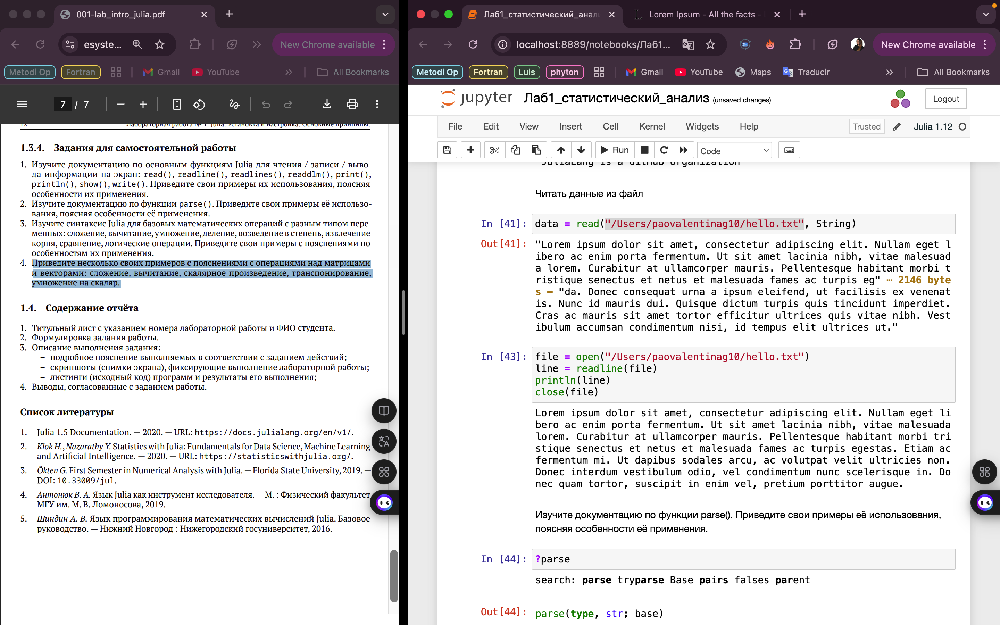
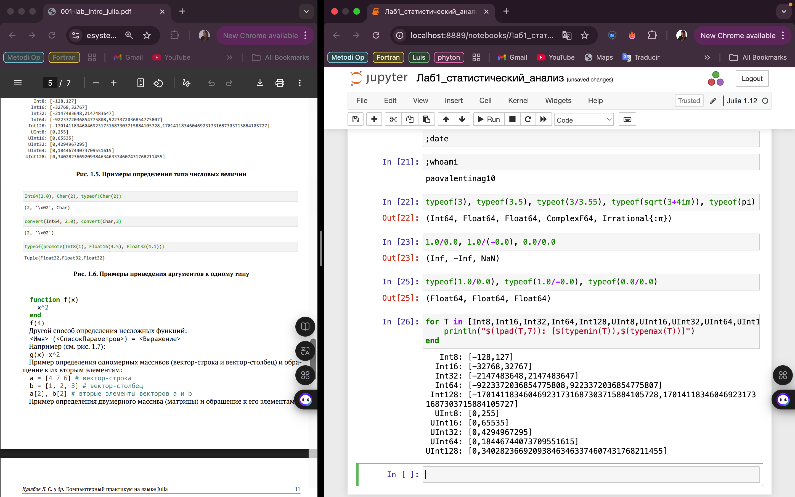
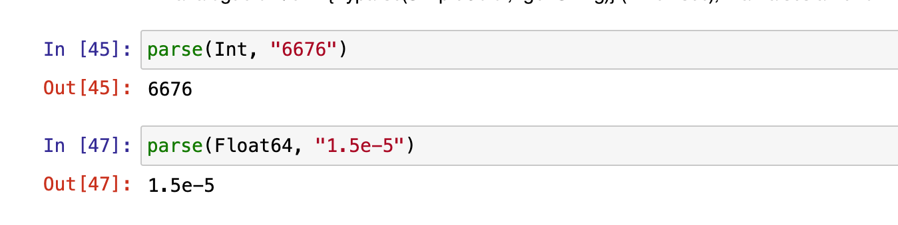
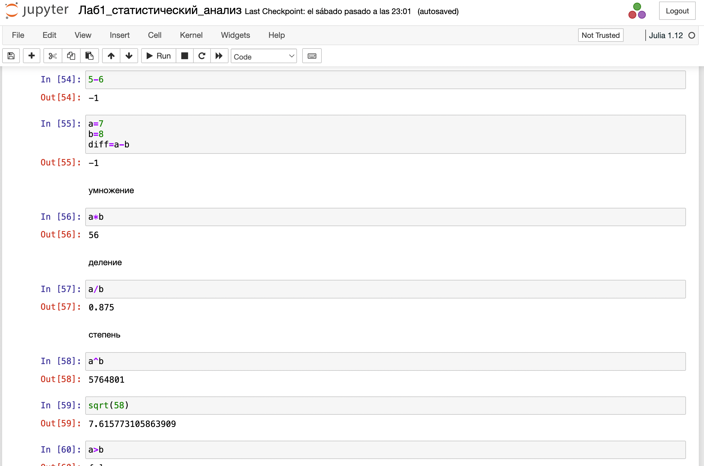
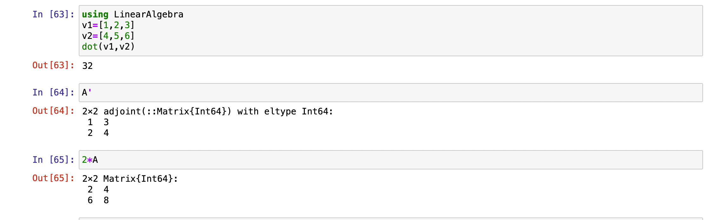

---
## Front matter
lang: ru-RU
title: Лабораторная работа №1
subtitle: Julia. Установка и настройка. Основные принципы.
author:
  - Герра Гарсия Паола Валентина
institute:
  - Российский университет дружбы народов, Москва, Россия

## i18n babel
babel-lang: russian
babel-otherlangs: english

## Formatting pdf
toc: false
toc-title: Содержание
slide_level: 2
aspectratio: 169
section-titles: true
theme: metropolis
header-includes:
 - \metroset{progressbar=frametitle,sectionpage=progressbar,numbering=fraction}
---

# Информация

## Докладчик

:::::::::::::: {.columns align=center}
::: {.column width="70%"}

  * Герра Гарсия Паола Валентина
  * студентка
  * Российский университет дружбы народов
  * [1032225472@pfur.ru](mailto:1032225472@pfur.ru)

:::
::: {.column width="25%"}

:::
::::::::::::::

## Цель работы

Основная цель работы — подготовить рабочее пространство и инструментарий для
работы с языком программирования Julia, на простейших примерах познакомиться
с основами синтаксиса Julia.

## Задание

1. Установите под свою операционную систему Julia, Jupyter.
2. Используя Jupyter Lab, повторите примеры из раздела лабораторной работы.
3. Выполните задания для самостоятельной работы.

# Выполнение лабораторной работы

{#fig:001 width=70%}

## Простейшие примеры на Julia

{#fig:002 width=60%}

## Простейшие примеры на Julia

{#fig:003 width=60%}

## Простейшие примеры на Julia

{#fig:004 width=55%}

## Задание №1

{#fig:005 width=40%}

## Задание №1

{#fig:006 width=60%}

## Задание №1

{#fig:007 width=30%}

## Задание №1

{#fig:008 width=50%}

## Задание №2

{#fig:009 width=70%}

## Задание №2

{#fig:010 width=70%}

## Задание №3

{#fig:011 width=40%}

## Задание №3

{#fig:012 width=25%}

## Задание №4

{#fig:013 width=40%}

## Задание №4

{#fig:014 width=25%}

## Выводы

В результате выполнения данной лабораторной работы я подготовила рабочее пространство и инструментарий для
работы с языком программирования Julia, на простейших примерах познакомилась
с основами синтаксиса Julia.

## Список литературы

1. JuliaLang [Электронный ресурс]. 2024 JuliaLang.org contributors. URL: https://julialang.org/ (дата обращения: 11.10.2024).
2. Julia 1.11 Documentation [Электронный ресурс]. 2024 JuliaLang.org contributors. URL: https://docs.julialang.org/en/v1/ (дата обращения: 11.10.2024).