---
## Front matter
title: "Лабораторная работа № 2"
subtitle: "Структуры данных"
author: "Герра Гарсия Паола Валентина"

## Generic otions
lang: ru-RU
toc-title: "Содержание"

## Bibliography
bibliography: bib/cite.bib
csl: pandoc/csl/gost-r-7-0-5-2008-numeric.csl

## Pdf output format
toc: true # Table of contents
toc-depth: 2
lof: true # List of figures
lot: false # List of tables
fontsize: 12pt
linestretch: 1.5
papersize: a4
documentclass: scrreprt
## I18n polyglossia
polyglossia-lang:
  name: russian
  options:
	- spelling=modern
	- babelshorthands=true
polyglossia-otherlangs:
  name: english
## I18n babel
babel-lang: russian
babel-otherlangs: english
## Fonts
mainfont: IBM Plex Serif
romanfont: IBM Plex Serif
sansfont: IBM Plex Sans
monofont: IBM Plex Mono
mathfont: STIX Two Math
mainfontoptions: Ligatures=Common,Ligatures=TeX,Scale=0.94
romanfontoptions: Ligatures=Common,Ligatures=TeX,Scale=0.94
sansfontoptions: Ligatures=Common,Ligatures=TeX,Scale=MatchLowercase,Scale=0.94
monofontoptions: Scale=MatchLowercase,Scale=0.94,FakeStretch=0.9
mathfontoptions:
## Biblatex
biblatex: true
biblio-style: "gost-numeric"
biblatexoptions:
  - parentracker=true
  - backend=biber
  - hyperref=auto
  - language=auto
  - autolang=other*
  - citestyle=gost-numeric
## Pandoc-crossref LaTeX customization
figureTitle: "Рис."
tableTitle: "Таблица"
listingTitle: "Листинг"
lofTitle: "Список иллюстраций"
lotTitle: "Список таблиц"
lolTitle: "Листинги"
## Misc options
indent: true
header-includes:
  - \usepackage{indentfirst}
  - \usepackage{float} # keep figures where there are in the text
  - \floatplacement{figure}{H} # keep figures where there are in the text
---

# Цель работы

Основная цель работы -- изучить несколько структур данных, реализованных в Julia,
научиться применять их и операции над ними для решения задач.

# Задание

1. Используя Jupyter Lab, повторите примеры.
2. Выполните задания для самостоятельной работы.

# Теоретическое введение

Julia -- высокоуровневый свободный язык программирования с динамической типизацией, созданный для математических вычислений [@julialang]. Эффективен также и для написания программ общего назначения. Синтаксис языка схож с синтаксисом других математических языков, однако имеет некоторые существенные отличия.

Для выполнения заданий была использована официальная документация Julia [@juliadoc].

Рассмотрим несколько структур данных, реализованных в Julia.
Несколько функций (методов), общих для всех структур данных:

- isempty() -- проверяет, пуста ли структура данных;
- length() -- возвращает длину структуры данных;
- in() -- проверяет принадлежность элемента к структуре;
- unique() -- возвращает коллекцию уникальных элементов структуры,
- reduce() -- свёртывает структуру данных в соответствии с заданным бинарным оператором;
- maximum() (или minimum()) -- возвращает наибольший (или наименьший) результат
вызова функции для каждого элемента структуры данных.

# Выполнение лабораторной работы

Для начала выполним примеры из раздела про кортежи (рис. [-@fig:001]).

Кортеж (Tuple) -- структура данных (контейнер) в виде неизменяемой индексируемой
последовательности элементов какого-либо типа (элементы индексируются с единицы).

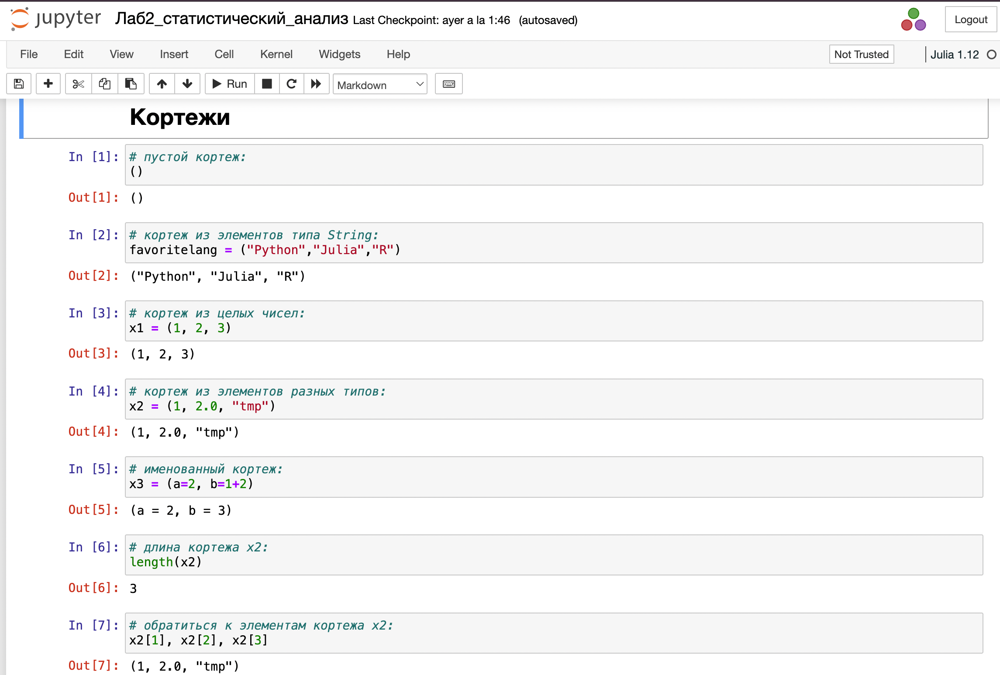{#fig:001 width=70%}

Теперь выполним примеры из раздела про словари (рис. [-@fig:002]).

Словарь -- неупорядоченный набор связанных между собой по ключу данных.

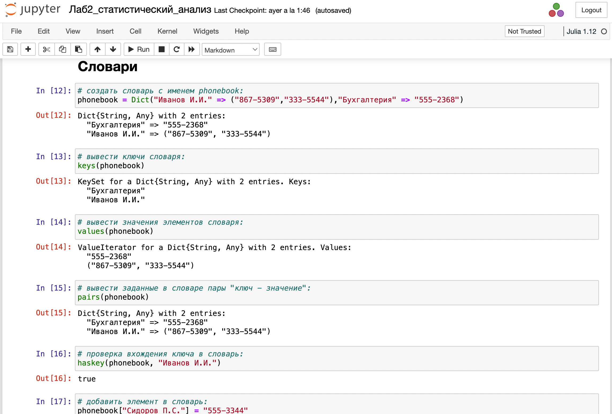{#fig:002 width=70%}

Выполним примеры из раздела про множества (рис. [-@fig:003]).

Множество, как структура данных в Julia, соответствует множеству, как математическому объекту, то есть является неупорядоченной совокупностью элементов какого-либо
типа. Возможные операции над множествами: объединение, пересечение, разность;
принадлежность элемента множеству.

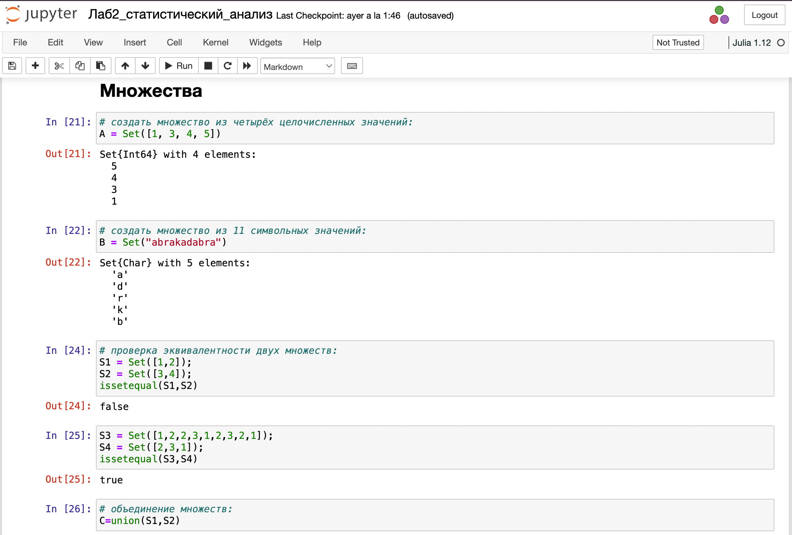{#fig:003 width=70%}

Выполним примеры из раздела про массивы (рис. [-@fig:003]-[-@fig:006]).

Массив — коллекция упорядоченных элементов, размещённая в многомерной сетке.
Векторы и матрицы являются частными случаями массивов.

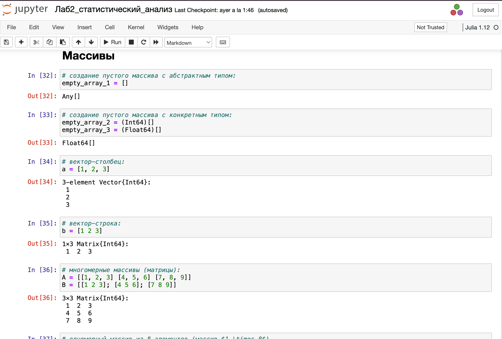{#fig:004 width=70%}

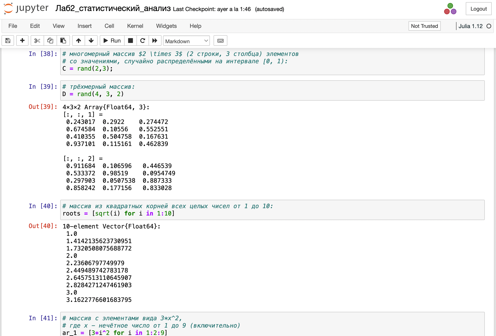{#fig:005 width=70%}

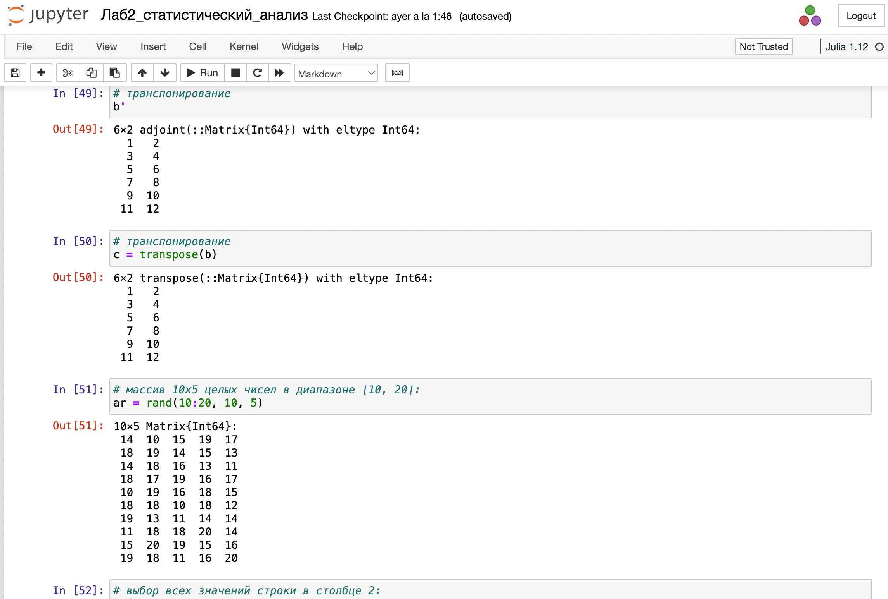{#fig:006 width=70%}

Перейдем к выполнению заданий.

1. Даны множества: $A = {0, 3, 4, 9}, B = {1, 3, 4, 7}, C = {0, 1, 2, 4, 7, 8, 9}$. Найдем
$P = A \cap B \cup A \cap B \cup A \cap C \cup B \cap C$ (рис. [-@fig:007]).

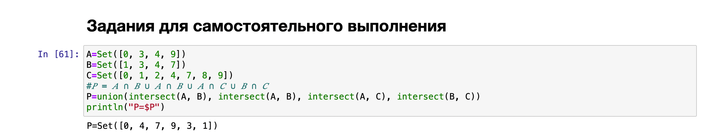{#fig:007 width=70%}

2. Приведем свои примеры с выполнением операций над множествами элементов
разных типов (рис. [-@fig:008]).

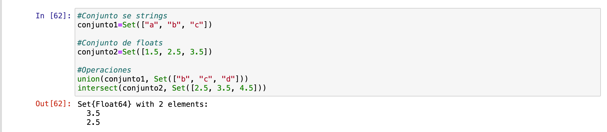{#fig:008 width=70%}

3. Создадим массивы разными способами, используя циклы (рис. [-@fig:009]-[-@fig:019]):
   
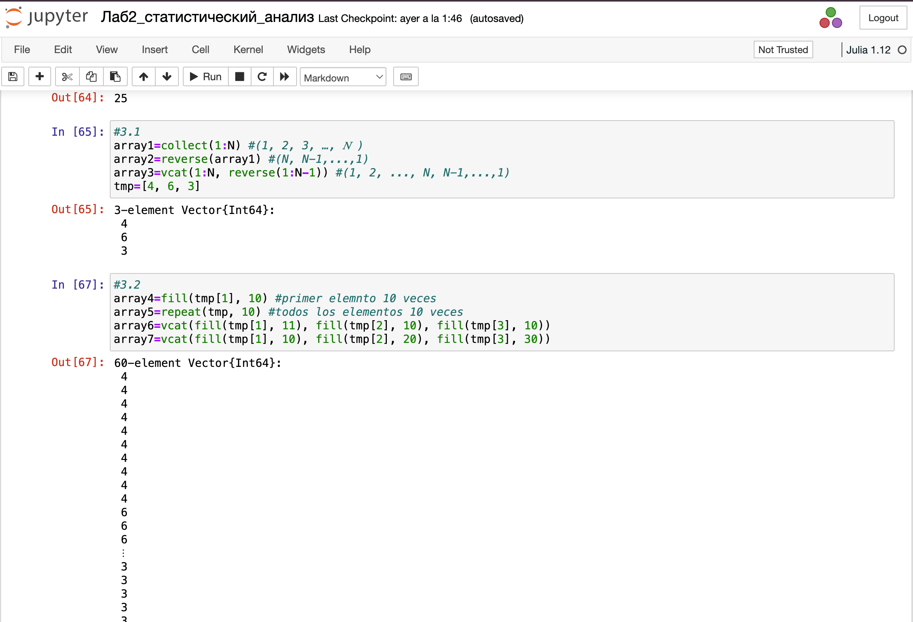{#fig:009 width=70%}

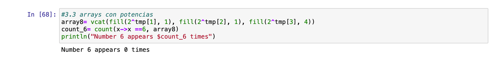{#fig:010 width=70%}

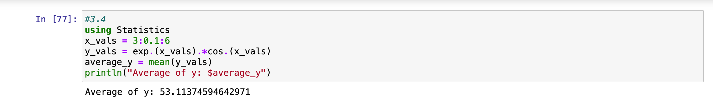{#fig:011 width=70%}

{#fig:012 width=70%}

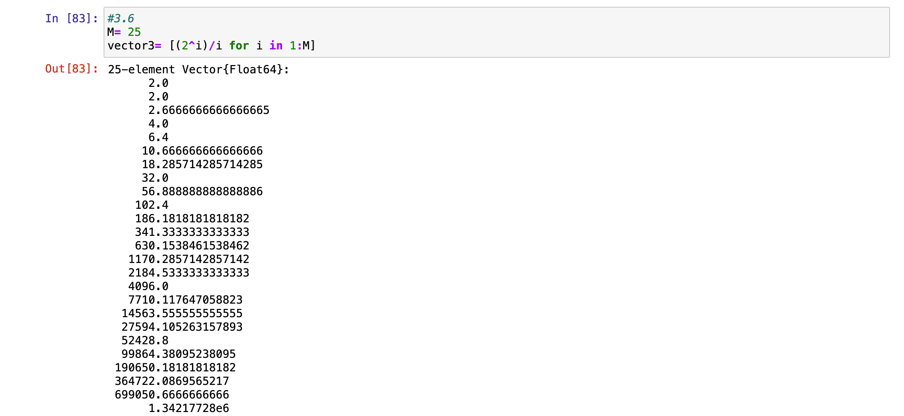{#fig:013 width=70%}

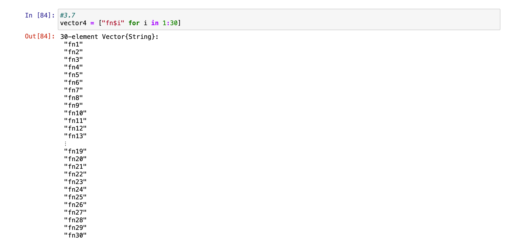{#fig:014 width=70%}

{#fig:015 width=70%}

{#fig:016 width=70%}

{#fig:017 width=70%}

{#fig:018 width=70%}

{#fig:019 width=70%}

4. Создадим массив squares, в котором будут храниться квадраты всех целых чисел от 1
до 100 (рис. [-@fig:020]).

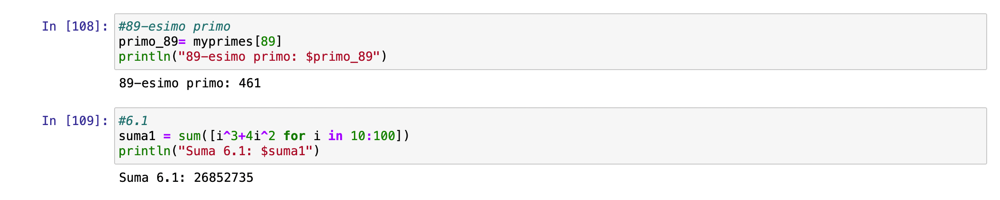{#fig:020 width=70%}

5. Подключим пакет Primes (функции для вычисления простых чисел). Сгенерируем
массив myprimes, в котором будут храниться первые 168 простых чисел. Определим
89-е наименьшее простое число. Получии срез массива с 89-го до 99-го элемента
включительно, содержащий наименьшие простые числа (рис. [-@fig:021]).

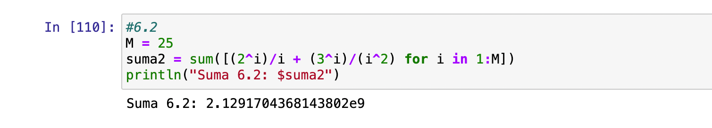{#fig:021 width=70%}

6. Вычислим следующие выражения (рис. [-@fig:022]).

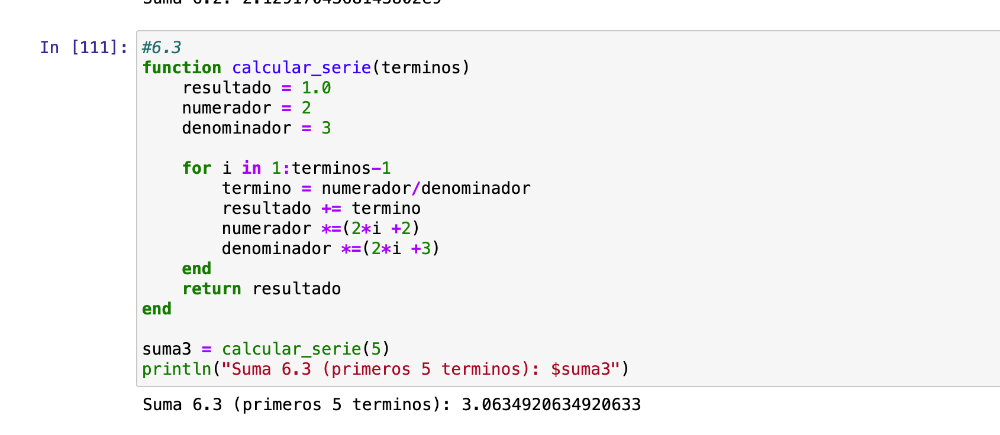{#fig:022 width=70%}

# Выводы

В результате выполнения данной лабораторной работы я изучила несколько структур данных, реализованных в Julia,
научилась применять их и операции над ними для решения задач.

# Список литературы{.unnumbered}

::: {#refs}
:::
