---
## Front matter
title: "Лабораторная работа № 4"
subtitle: "Линейная алгебра"
author: "Герра Гарсия Паола Валентина"

## Generic otions
lang: ru-RU
toc-title: "Содержание"

## Bibliography
bibliography: bib/cite.bib
csl: pandoc/csl/gost-r-7-0-5-2008-numeric.csl

## Pdf output format
toc: true # Table of contents
toc-depth: 2
lof: true # List of figures
lot: false # List of tables
fontsize: 12pt
linestretch: 1.5
papersize: a4
documentclass: scrreprt
## I18n polyglossia
polyglossia-lang:
  name: russian
  options:
	- spelling=modern
	- babelshorthands=true
polyglossia-otherlangs:
  name: english
## I18n babel
babel-lang: russian
babel-otherlangs: english
## Fonts
mainfont: IBM Plex Serif
romanfont: IBM Plex Serif
sansfont: IBM Plex Sans
monofont: IBM Plex Mono
mathfont: STIX Two Math
mainfontoptions: Ligatures=Common,Ligatures=TeX,Scale=0.94
romanfontoptions: Ligatures=Common,Ligatures=TeX,Scale=0.94
sansfontoptions: Ligatures=Common,Ligatures=TeX,Scale=MatchLowercase,Scale=0.94
monofontoptions: Scale=MatchLowercase,Scale=0.94,FakeStretch=0.9
mathfontoptions:
## Biblatex
biblatex: true
biblio-style: "gost-numeric"
biblatexoptions:
  - parentracker=true
  - backend=biber
  - hyperref=auto
  - language=auto
  - autolang=other*
  - citestyle=gost-numeric
## Pandoc-crossref LaTeX customization
figureTitle: "Рис."
tableTitle: "Таблица"
listingTitle: "Листинг"
lofTitle: "Список иллюстраций"
lotTitle: "Список таблиц"
lolTitle: "Листинги"
## Misc options
indent: true
header-includes:
  - \usepackage{indentfirst}
  - \usepackage{float} # keep figures where there are in the text
  - \floatplacement{figure}{H} # keep figures where there are in the text
---

# Цель работы

Основной целью работы является изучение возможностей специализированных пакетов Julia для выполнения и оценки эффективности операций над объектами линейной
алгебры.

# Задание

1. Используя JupyterLab, повторите примеры.
2. Выполните задания для самостоятельной работы.

# Теоретическое введение

Julia -- высокоуровневый свободный язык программирования с динамической типизацией, созданный для математических вычислений [@julialang]. Эффективен также и для написания программ общего назначения. Синтаксис языка схож с синтаксисом других математических языков, однако имеет некоторые существенные отличия.

Для выполнения заданий была использована официальная документация Julia [@juliadoc].

# Выполнение лабораторной работы

Выполним примеры из раздела про поэлементные операции над многомерными массивами (рис. [-@fig:001]-[-@fig:002]).

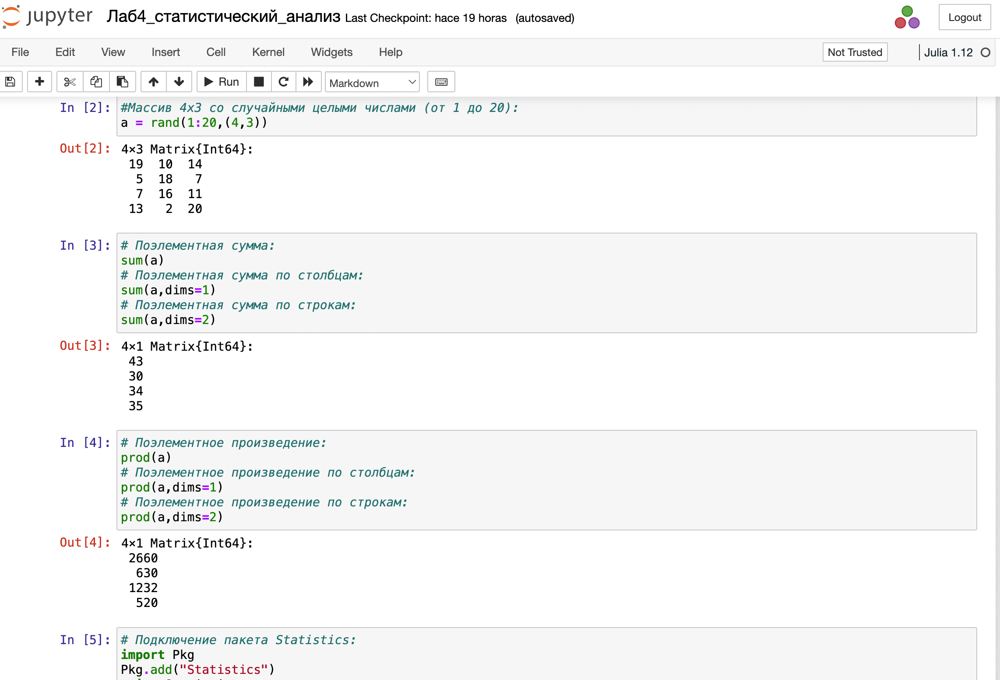{#fig:001 width=70%}

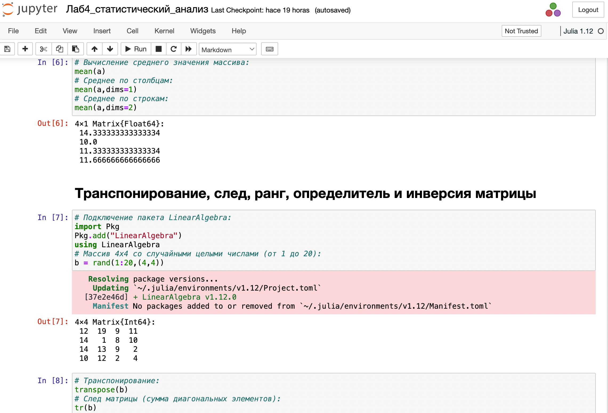{#fig:002 width=70%}

Выполним примеры из раздела про транспонирование,след,ранг,определительи инверсия матрицы (рис. [-@fig:003]).

{#fig:003 width=70%}

Выполним примеры из раздела про матричное умножение,единичная матрица,скалярное
произведение (рис. [-@fig:004]).

{#fig:004 width=70%}

Выполним примеры из раздела про факторизацию и специальные матричные структуры (рис. [-@fig:004]-[-@fig:007]).

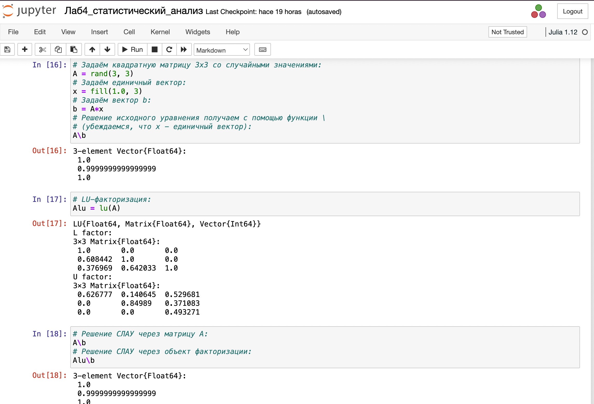{#fig:005 width=70%}

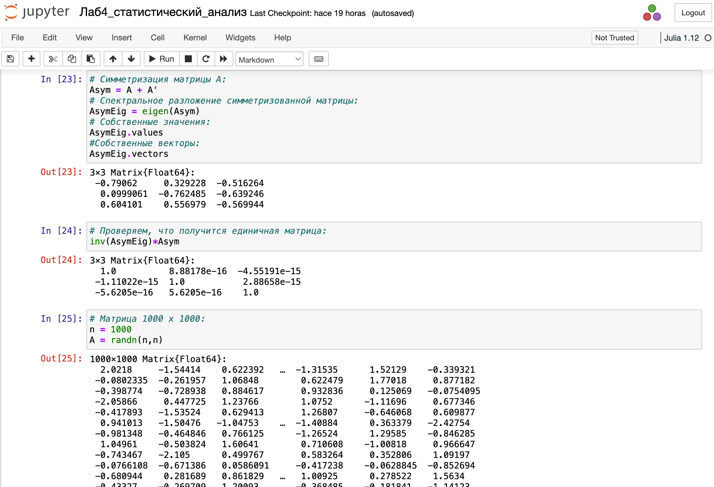{#fig:006 width=70%}

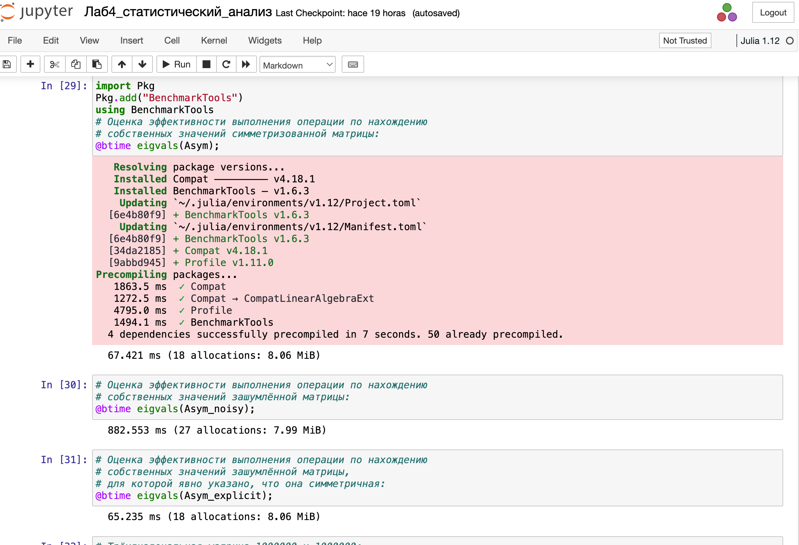{#fig:007 width=70%}

Выполним примеры из раздела про общую линейную алгебру (рис. [-@fig:008]).

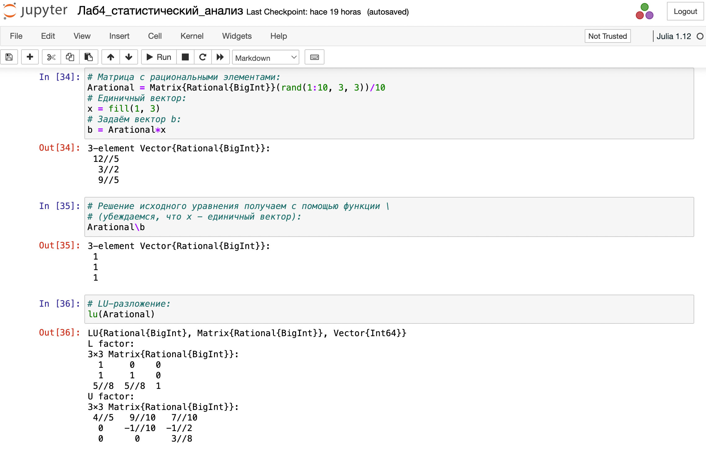{#fig:008 width=70%}

## Заданиядля самостоятельного выполнения

Зададим вектор v. Умножим вектор v скалярно сам на себя и сохраним результат
вdot_v (рис. [-@fig:009]).

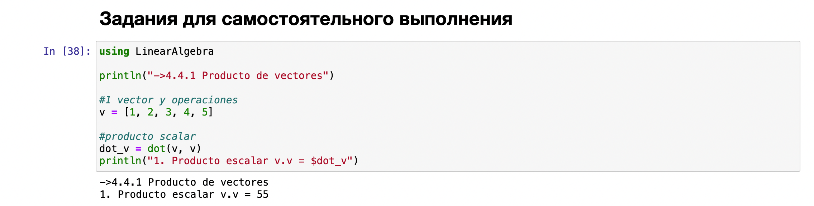{#fig:009 width=70%}

Умножим v матрично на себя(внешнее произведение), присвоив результат переменной outer_v (рис. [-@fig:010]).

{#fig:010 width=70%}

Решим СЛАУ с двумя неизвестными (рис. [-@fig:011]-[-@fig:012]).

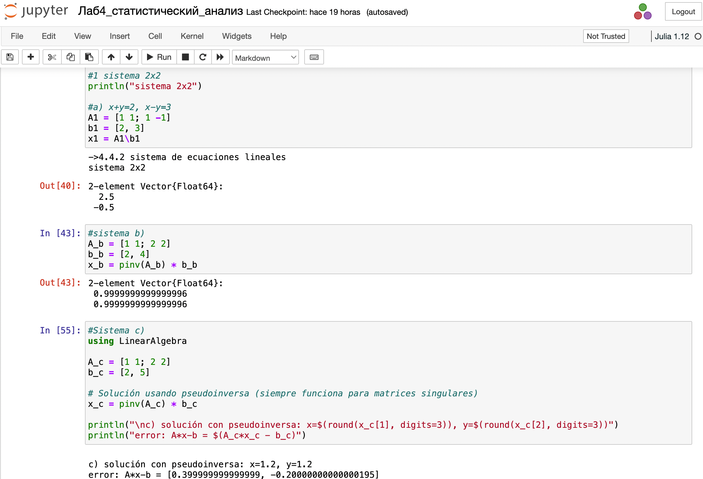{#fig:011 width=70%}

{#fig:012 width=70%}

Решим СЛАУ с тремя неизвестными (рис. [-@fig:013]).

{#fig:013 width=70%}

Приведем матрицы к диагональному виду (рис. [-@fig:014]).

{#fig:014 width=70%}

Вычислим (рис. [-@fig:015]).

{#fig:015 width=70%}

Найдем собственные значения матрицы A. Создадим диагональную матрицу из собственных значений матрицы A. Создадим
нижнедиагональную матрицу из матрицы A. Оценим эффективность выполняемых
операций (рис. [-@fig:016]).

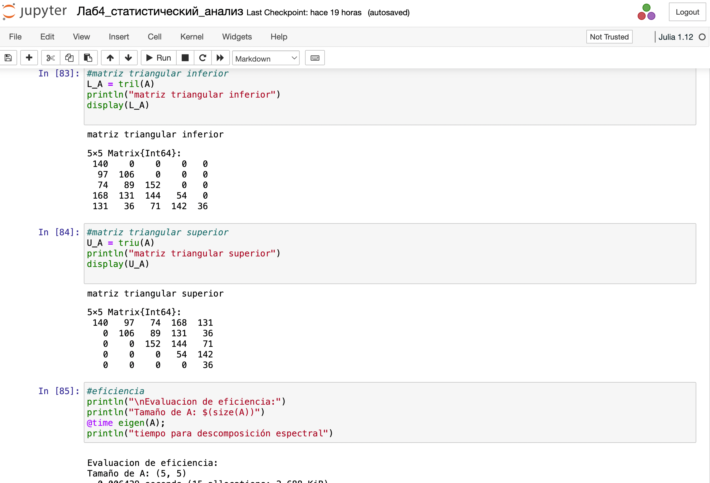{#fig:016 width=70%}

Линейная модель может быть записана как СЛАУ

$$x - Ax = y,$$

где элементы матрицы A и столбца y -- неотрицательные числа. По своему смыслу в экономике элементы матрицы A и столбцов x, y не могут быть отрицательными числами. 

Матрица A называется продуктивной,если решение x системы при любой неотрицательной правой части y имеет только неотрицательные элементы $x_i$.Используя это
определение, проверим, являются ли матрицып родуктивными (рис. [-@fig:017]-[-@fig:018]).

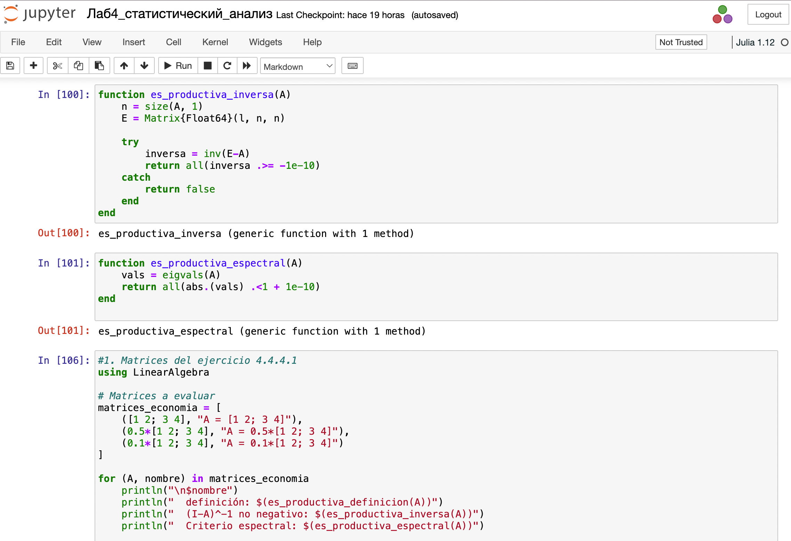{#fig:017 width=70%}

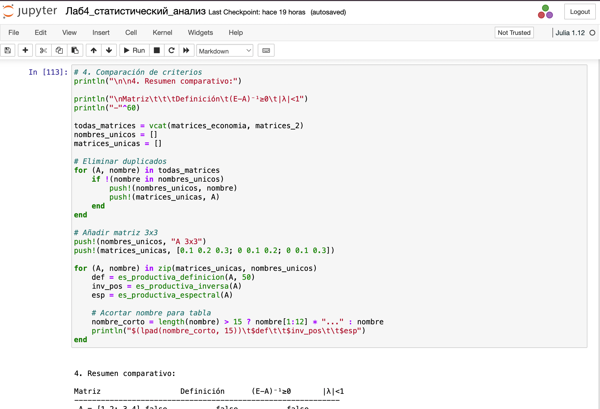{#fig:018 width=70%}

# Выводы

В процессе выполнения данной лабораторной работы я изучила возможности специализированных пакетов Julia для выполнения и оценки эффективности операций над объектами линейной
алгебры.

# Список литературы{.unnumbered}

::: {#refs}
:::
