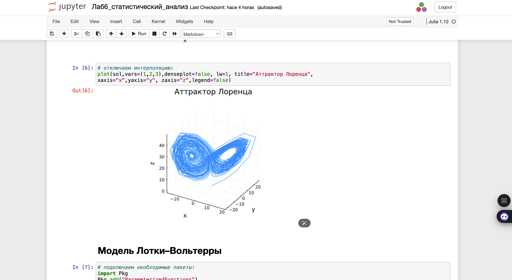
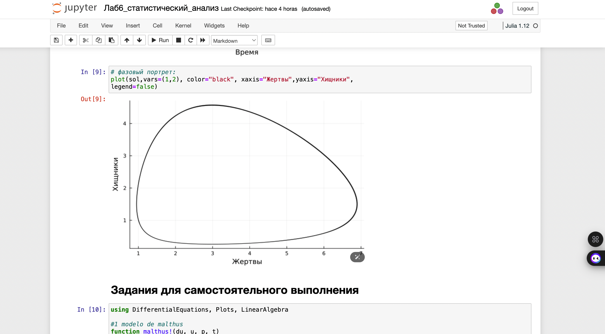
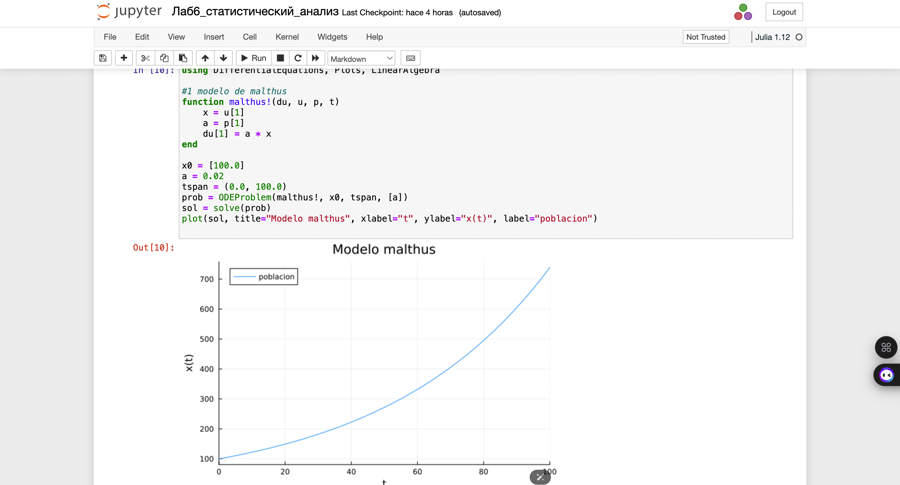
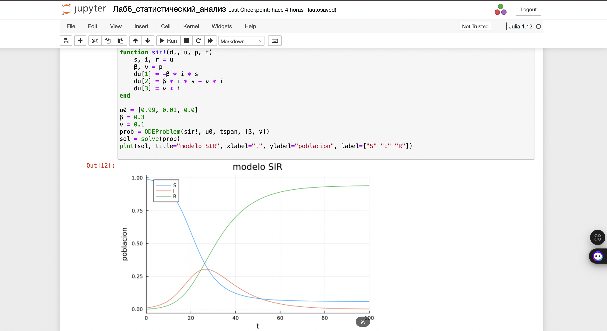
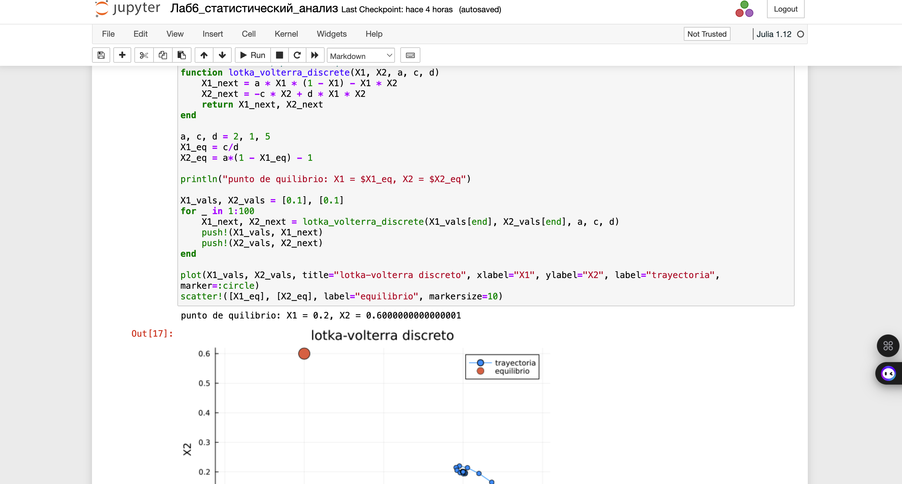
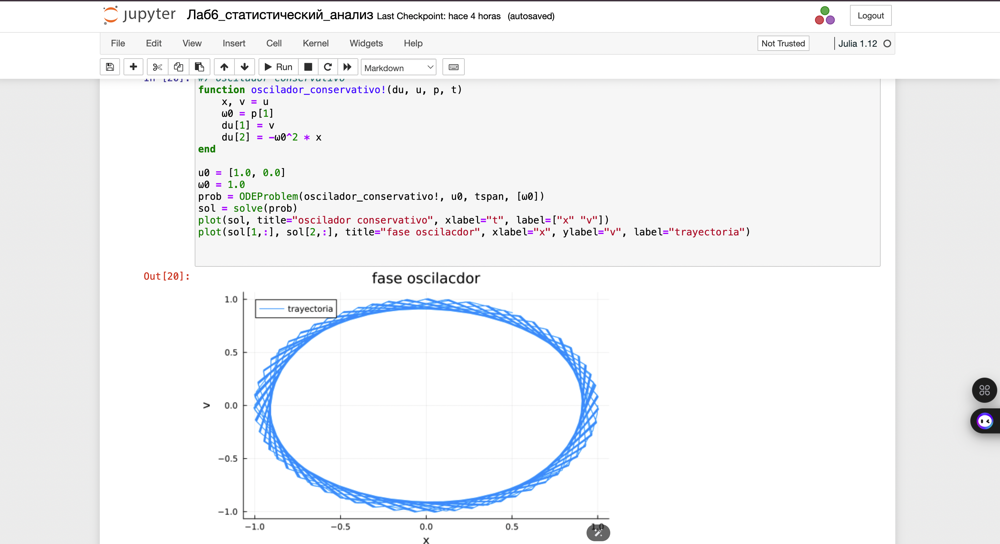

---
## Front matter
title: "Лабораторная работа № 6"
subtitle: "Решение моделей в непрерывном и дискретном времени"
author: "Герра Гарсия Паола Валентина"

## Generic otions
lang: ru-RU
toc-title: "Содержание"

## Bibliography
bibliography: bib/cite.bib
csl: pandoc/csl/gost-r-7-0-5-2008-numeric.csl

## Pdf output format
toc: true # Table of contents
toc-depth: 2
lof: true # List of figures
lot: false # List of tables
fontsize: 12pt
linestretch: 1.5
papersize: a4
documentclass: scrreprt
## I18n polyglossia
polyglossia-lang:
  name: russian
  options:
	- spelling=modern
	- babelshorthands=true
polyglossia-otherlangs:
  name: english
## I18n babel
babel-lang: russian
babel-otherlangs: english
## Fonts
mainfont: IBM Plex Serif
romanfont: IBM Plex Serif
sansfont: IBM Plex Sans
monofont: IBM Plex Mono
mathfont: STIX Two Math
mainfontoptions: Ligatures=Common,Ligatures=TeX,Scale=0.94
romanfontoptions: Ligatures=Common,Ligatures=TeX,Scale=0.94
sansfontoptions: Ligatures=Common,Ligatures=TeX,Scale=MatchLowercase,Scale=0.94
monofontoptions: Scale=MatchLowercase,Scale=0.94,FakeStretch=0.9
mathfontoptions:
## Biblatex
biblatex: true
biblio-style: "gost-numeric"
biblatexoptions:
  - parentracker=true
  - backend=biber
  - hyperref=auto
  - language=auto
  - autolang=other*
  - citestyle=gost-numeric
## Pandoc-crossref LaTeX customization
figureTitle: "Рис."
tableTitle: "Таблица"
listingTitle: "Листинг"
lofTitle: "Список иллюстраций"
lotTitle: "Список таблиц"
lolTitle: "Листинги"
## Misc options
indent: true
header-includes:
  - \usepackage{indentfirst}
  - \usepackage{float} # keep figures where there are in the text
  - \floatplacement{figure}{H} # keep figures where there are in the text
---

# Цель работы

Основной целью работы является освоение специализированных пакетов для решения задач в непрерывном и дискретном времени.

# Задание

1. Используя JupyterLab, повторите примерыи. При этом дополните графики
обозначениями осей координат, легендой с названиями траекторий, названиями
графиков и т.п.

2. Выполните задания для самостоятельной работы.

# Теоретическое введение

Julia -- высокоуровневый свободный язык программирования с динамической типизацией, созданный для математических вычислений [@julialang]. Эффективен также и для написания программ общего назначения. Синтаксис языка схож с синтаксисом других математических языков, однако имеет некоторые существенные отличия.

Для выполнения заданий была использована официальная документация Julia [@juliadoc].

# Выполнение лабораторной работы

Выполним примеры из лабораторной работы для знакомства с работой с различными моделями и способами их задания  решения (рис. [-@fig:001]-[-@fig:003]).

{#fig:001 width=70%}

{#fig:002 width=70%}

{#fig:003 width=70%}

Далее перейдем к заданиям для самостоятельного выполнения.

Реализуем и проанализируем модель роста численности изолированной популяции(модель Мальтуса):

$$\dot x = ax, \quad a = b - c,$$

где $x(t)$ -- численность изолированной популяции в момент времени $t$,$a$ -- коэффициент роста популяции, $b$ -- коэффициент рождаемости, $c$ -- коэффициент смертности.
Построим соответствующие графики (в том числе с анимацией) (рис. [-@fig:004]-[-@fig:005]).

{#fig:004 width=70%}

{#fig:005 width=70%}

Реализуем и проанализируем логистическую модель роста популяции:

$$\dot x = rx(1 - \dfrac{x}{k}), \quad r>0, \quad k>0,$$

где $r$ -- коэффициент роста популяции, $k$ -- потенциальная ёмкость экологической системы (предельное значение численности популяции).
Построим соответствующие графики (в том числе с анимацией) (рис. [-@fig:006]-[-@fig:007]).

{#fig:006 width=70%}

{#fig:007 width=70%}

Реализуем и проанализируем логистическую модель эпидемии Кермака–Маккендрика (SIR-модель):

$$
\begin{cases}
\dot S = - \beta I S, \\
\dot I = \beta I S - \gamma I, \\
\dot R = \gamma I,
\end{cases}
$$

где $S$ -- численность восприимчивой популяции, $I$ -- численность инфицированных, $R$ -- численность удаленной популяции (в результате смерти или выздоровления), и $N$ — это сумма этих трёх, а $\beta$ и $\gamma$ - это коэффициенты заболеваемости
и выздоровления соответственно (рис. [-@fig:008]).

{#fig:008 width=70%}

Как расширение модели SIR (Susceptible-Infected-Removed) по результатам эпидемии испанки была предложена модель SEIR (Susceptible-Exposed-Infected-Removed) (рис. [-@fig:009]).

$$
\begin{cases}
\dot S = - \dfrac{\beta}{N} I S, \\
\dot E = \dfrac{\beta}{N} I S - \delta E, \\
\dot I = \delta E - \gamma I, \\
\dot R = \gamma I,
\end{cases}
$$

{#fig:009 width=70%}

Для дискретной модели Лотки–Вольтерры:

$$
\begin{cases}
X_1(t+1) = a X_1(t)(1-X_1(t)) - X_1(t) X_2(t), \\
X_2(t+1) = -c X_2(t) - d X_1(t) X_2(t).
\end{cases}
$$

с начальными данными $a = 2, c = 1, d = 5$ найдем точку равновесия. Получим и сравним аналитическое и численное решения (рис. [-@fig:010]).

{#fig:010 width=70%}

Реализуем на языке Julia модель отбора на основе конкурентных отношений:

$$
\begin{cases}
\dot x = \alpha x - \beta xy, \\
\dot y = \alpha y - \beta xy,
\end{cases}
$$

Построим соответствующие графики (в том числе с анимацией) и фазовый портрет (рис. [-@fig:011]-[-@fig:012]).

{#fig:011 width=70%}

{#fig:012 width=70%}

Реализуем на языке Julia модель консервативного гармонического осциллятора:

$$
\ddot x + \omega _0 ^2 = 0, x(t_0) = x_0, \dot x(t_0) = y_0.
$$

Построим соответствующие графики (в том числе с анимацией) и фазовый портрет (рис. [-@fig:013]-[-@fig:014]).

{#fig:013 width=70%}

{#fig:014 width=70%}

Реализуем на языке Julia модель свободных колебаний гармонического осциллятора:

$$
\ddot x + 2\gamma \dot x + \omega _0 ^2 = 0, x(t_0) = x_0, \dot x(t_0) = y_0.
$$

Построим соответствующие графики (в том числе с анимацией) и фазовый портрет (рис. [-@fig:015]-[-@fig:016]).

{#fig:015 width=70%}

{#fig:016 width=70%}

# Выводы

В результате выполнения данной лабораторной работы я освоила специализированные пакеты для решения задач в непрерывном и дискретном времени.

# Список литературы{.unnumbered}

::: {#refs}
:::
