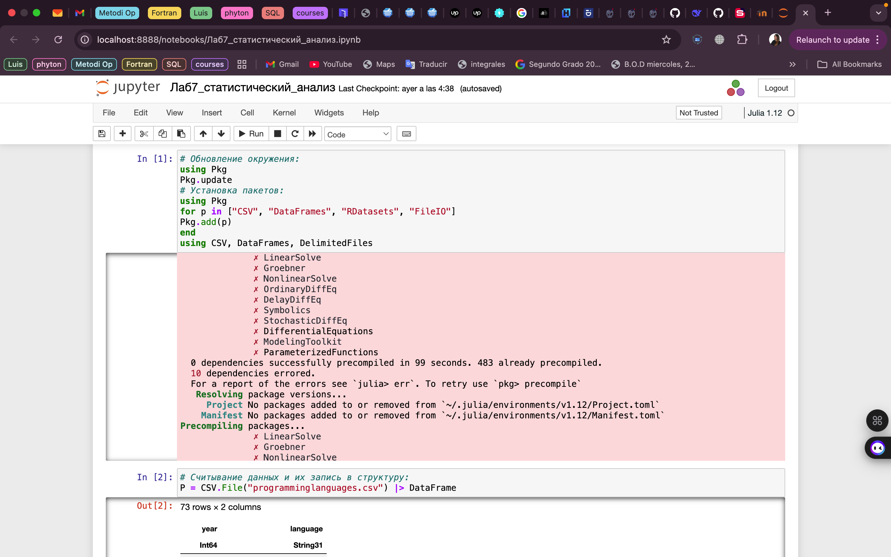
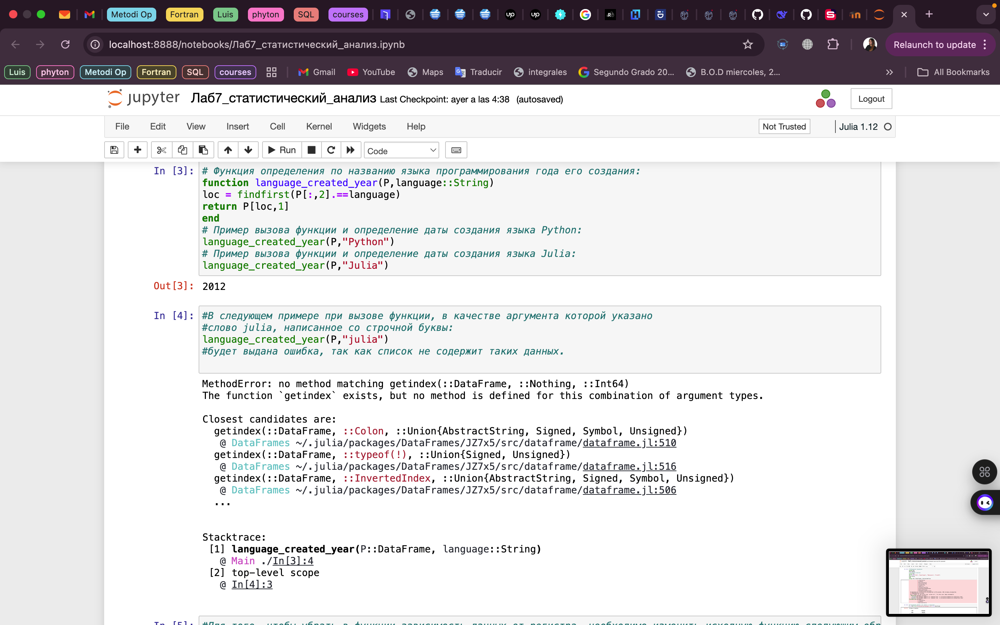
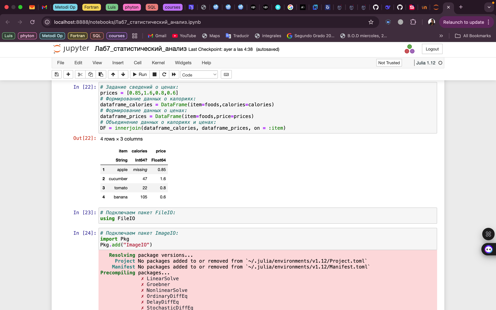
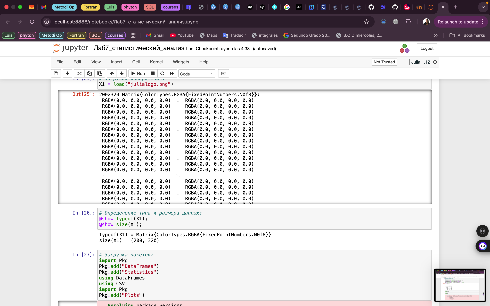
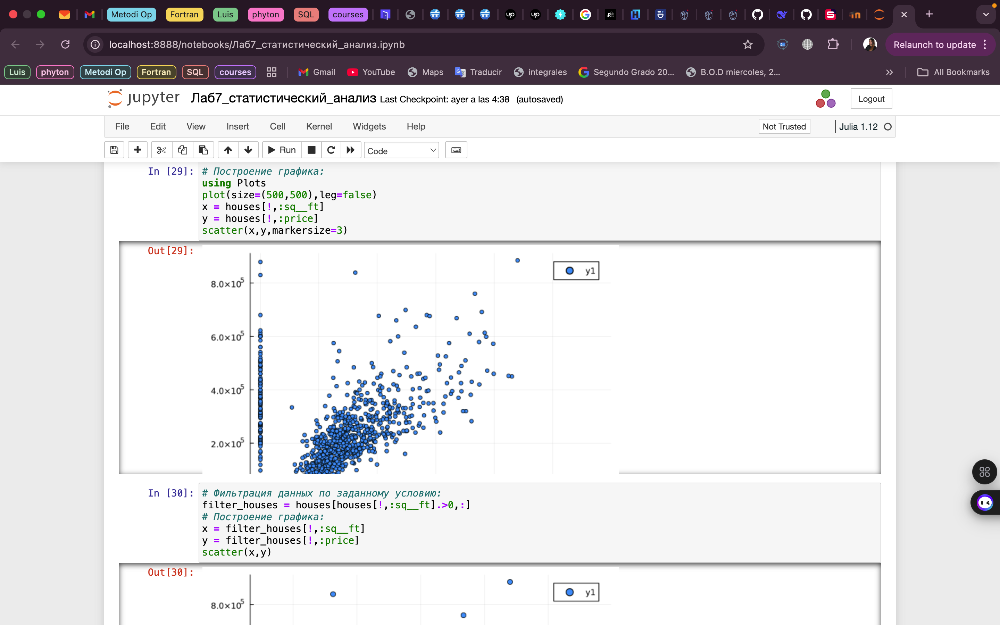
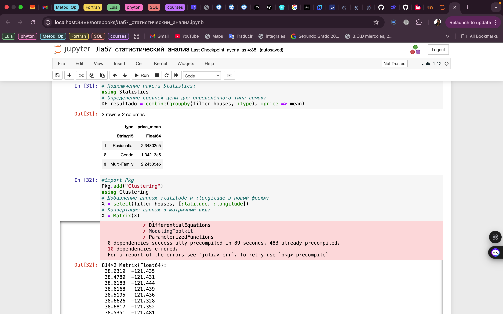
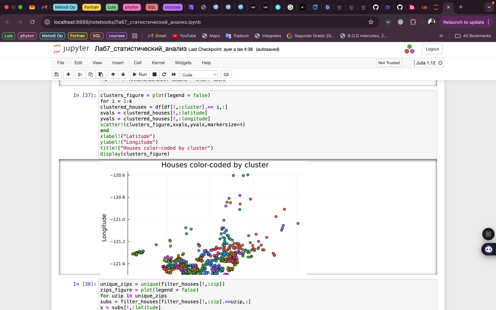
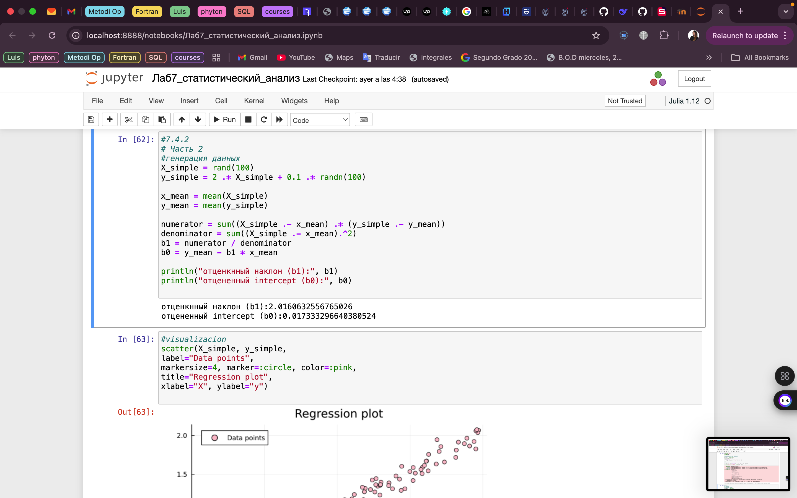
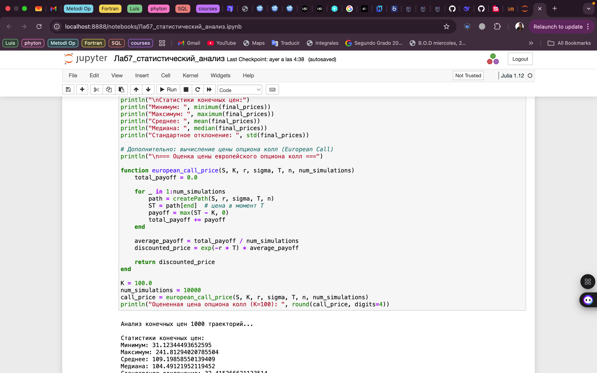

---
## Front matter
lang: ru-RU
title: Лабораторная работа № 7
subtitle: Введение в работу сданными
author:
  - Герра Гарсия Паола Валентина
institute:
  - Российский университет дружбы народов, Москва, Россия

## i18n babel
babel-lang: russian
babel-otherlangs: english

## Formatting pdf
toc: false
toc-title: Содержание
slide_level: 2
aspectratio: 169
section-titles: true
theme: metropolis
header-includes:
 - \metroset{progressbar=frametitle,sectionpage=progressbar,numbering=fraction}
---

# Информация

## Докладчик

:::::::::::::: {.columns align=center}
::: {.column width="70%"}

  * Герра Гарсия Паола Валентина
  * студентка
  * Российский университет дружбы народов
  * [1032225472@pfur.ru](mailto:1032225472@pfur.ru)

:::
::: {.column width="25%"}

:::
::::::::::::::

## Цель работы

Основной целью работы является освоение специализированных пакетов Julia для обработки данных.

## Задание

1. Используя JupyterLab, повторите примерыи. При этом дополните графики
обозначениями осей координат, легендой с названиями траекторий, названиями
графиков и т.п.

2. Выполните задания для самостоятельной работы.

## Выполнение лабораторной работы

{#fig:001 width=50%}

## Выполнение лабораторной работы

{#fig:002 width=45%}

## Выполнение лабораторной работы

{#fig:003 width=50%}

## Выполнение лабораторной работы

{#fig:004 width=35%}

## Выполнение лабораторной работы

{#fig:005 width=50%}

## Выполнение лабораторной работы

{#fig:006 width=50%}

## Выполнение лабораторной работы

{#fig:007 width=35%}

## Выполнение лабораторной работы

{#fig:008 width=45%}

## Выполнение лабораторной работы

{#fig:009 width=35%}

## Выполнение лабораторной работы

{#fig:010 width=50%}

## Выполнение лабораторной работы

{#fig:011 width=35%}

## Выполнение лабораторной работы

{#fig:012 width=35%}

## Выполнение лабораторной работы

{#fig:013 width=50%}

## Выполнение лабораторной работы

{#fig:014 width=50%}

## Выполнение лабораторной работы

{#fig:015 width=50%}

## Выполнение лабораторной работы

{#fig:016 width=45%}

## Выполнение лабораторной работы

{#fig:017 width=40%}

## Выполнение лабораторной работы

{#fig:018 width=50%}

## Выполнение лабораторной работы

{#fig:019 width=50%}

## Выполнение лабораторной работы

{#fig:020 width=50%}

## Выводы

В результате выполнения данной лабораторной работы я освоила специализированные пакеты Julia для обработки данных.

## Список литературы

1. JuliaLang [Электронный ресурс]. 2024 JuliaLang.org contributors. URL:https://julialang.org/(дата обращения: 11.10.2024).
2. Julia  1.11  Documentation  [Электронный  ресурс].  2024  JuliaLang.orgcontributors. URL:https://docs.julialang.org/en/v1/(дата обращения:11.10.2024).
